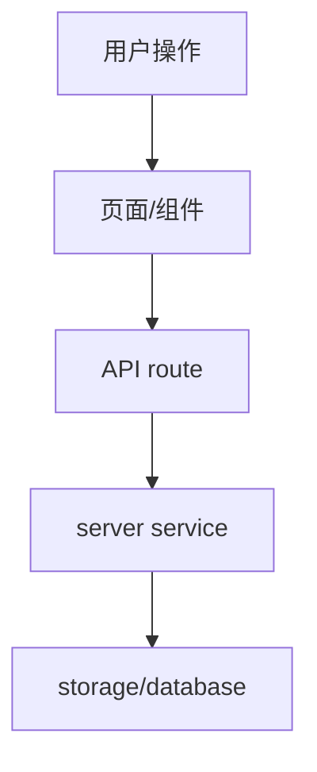

# architecture-design - 技术架构方案

> 触发方式：`/architecture`、`/tech-plan`、`技术方案`、`架构方案`、`架构设计`、`技术设计`

用于把工程规范和产品需求转成技术架构方案。只要用户在讨论“怎么设计技术实现、模块怎么分、数据/API/前端/服务端怎么落”，就使用本 skill。不要直接写代码。

---

## 输入契约

开始前读取：

- 工程规范：用户提供路径，或在 `docs/` 中寻找明显规范文档。
- 产品需求稿：用户提供路径，或在 `docs/` 中寻找明显需求文档。
- 项目入口：`AGENTS.md`、`docs/README.md`、`package.json`。
- 相关源码目录：只读和本方案有关的部分。

如果缺少产品需求稿，先补问需求边界。不要用技术方案替代产品决策。

---

## 目标

产出可交给开发执行的架构方案。方案要说明架构、视图、技术栈、模块边界、数据流、文件落点、风险和验证方式。

---

## 架构判断原则

- 推荐一个主方案，必要时给一个备选方案；不要堆很多选择让用户自己猜。
- 不为了小功能引入全局状态、事件总线、插件化、多层抽象或新依赖。
- 只有出现真实复用或稳定边界时才抽象。
- 前端、API route、server service、storage、shared/ui 的职责必须分清。
- 任何跨层依赖都要能解释必要性；解释不了就不要做。
- 技术方案必须服务产品流程，而不是展示架构技巧。

---

## 必须检查

- 是否符合工程规范。
- 是否有清晰的数据流和错误流。
- 是否有 DTO/类型边界。
- 是否需要数据迁移、兼容旧数据或回滚策略。
- 是否涉及权限、安全、路径、输入校验。
- 是否能分阶段实现，而不是一次改穿整个项目。

---

## 输出模板

````markdown
# 技术架构方案

## 推荐结论
[推荐方案 + 为什么合理 + 不采用什么方案。]

## 输入依据
- 工程规范：
- 产品需求：
- 当前项目结构：

## 需求与约束复述

## 架构总览


## 模块边界
| 模块 | 职责 | 不负责 |
|------|------|--------|

## 文件落点
| 路径 | 操作 | 说明 |
|------|------|------|

## 前端设计

## API 与数据契约

## 服务端与持久化设计

## 错误处理与用户反馈

## 安全、兼容与迁移

## 明确不做

## 风险与取舍

## 验证计划
````

最后建议保存为 `docs/architecture-plan.md`。只有用户明确要求落盘时才写文件。
