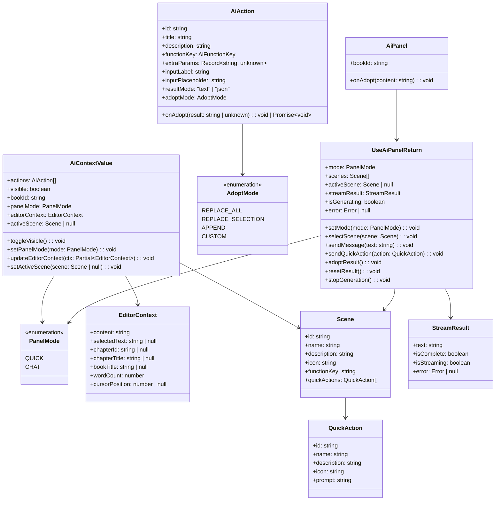
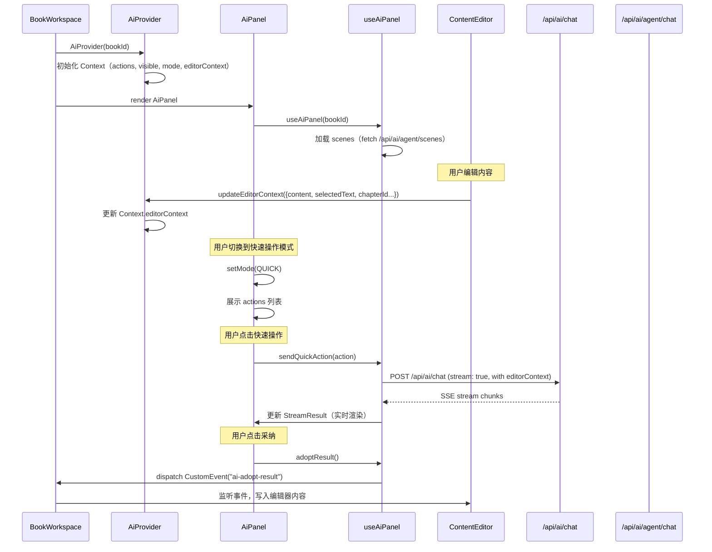
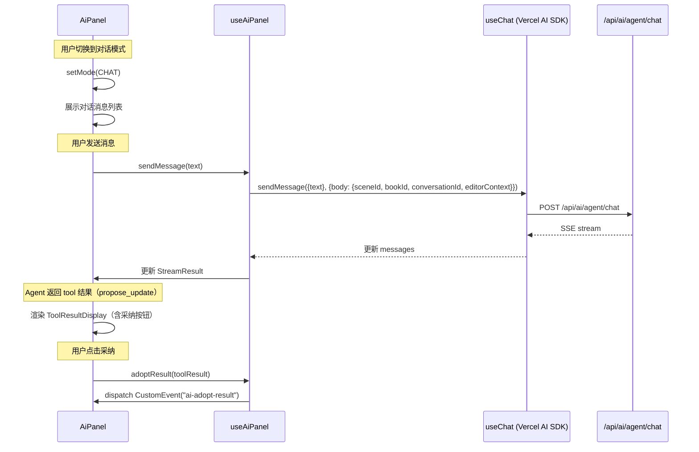
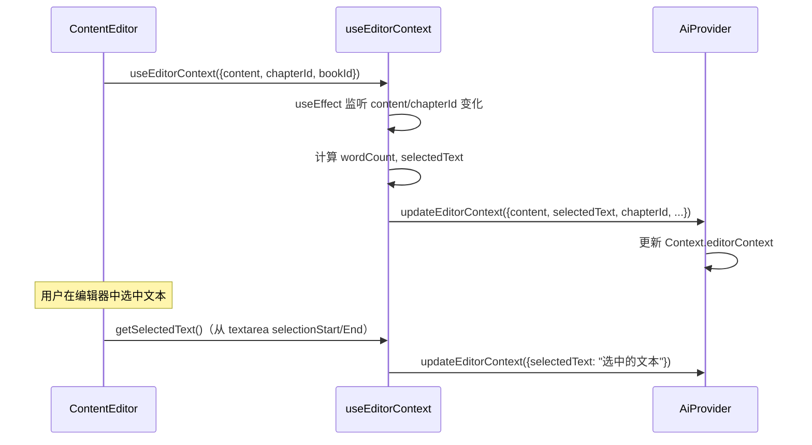
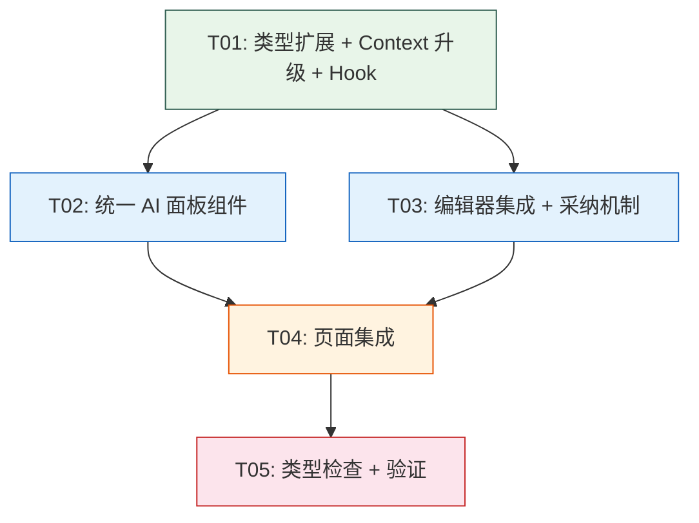

# AI 交互体验优化 — 系统设计文档

> 创建时间：2026-07-14
> 版本：1.0
> 设计师：Bob（Architect）

---

## Part A: 系统设计

### 1. 实现方案

#### 1.1 核心技术挑战

| 挑战 | 现状 | 目标 |
|------|------|------|
| AI 入口分散 | `AiAssistantPanel`（快速操作）和 `AiAgentPanel`（对话式）分离 | 统一 AI 面板，支持两种交互模式切换 |
| 上下文感知断裂 | ContentEditor 手动获取选中文本，与 AI 面板无直接通信 | 自动感知当前编辑器内容、章节、书籍上下文 |
| 流式结果展示分散 | `AiResultPanel` 独立处理流式，`AiAssistantPanel` 用 `useAiStream`，`AiAgentPanel` 用 `useChat` | 统一流式管道 + 统一结果展示组件 |
| 采纳机制不统一 | ContentEditor 内联采纳，AgentPanel 有采纳按钮但未连编辑器 | 全局快速采纳机制，一键写回编辑器 |

#### 1.2 架构决策

**模式选择：Context + Hook 分层架构**

```
┌───────────────────────────────────────────────────────┐
│                    AiProvider（扩展）                    │
│  ┌──────────┐  ┌──────────────┐  ┌──────────────────┐ │
│  │ 上下文状态 │  │ 模式/可见性   │  │ 操作注册（现有）  │ │
│  │ context   │  │ mode/visible │  │ registrations    │ │
│  └──────────┘  └──────────────┘  └──────────────────┘ │
└───────────────────────────────────────────────────────┘
        │                │                    │
        ▼                ▼                    ▼
┌──────────────┐  ┌──────────────┐  ┌──────────────────┐
│useAiContext   │  │useAiPanel     │  │useRegisterAi     │
│(编辑器内容感知)│  │(面板状态管理) │  │Actions           │
└──────────────┘  └──────────────┘  └──────────────────┘
```

**关键设计决策：**

1. **不引入新状态库**：沿用 React Context + Hooks，避免引入 Zustand/Jotai 等额外依赖
2. **统一流式管道**：扩展 `useAiStream` hook 支持 Agent 对话模式，移除 `AiAssistantPanel` 对 `useAiStream` 的直接依赖
3. **上下文通过 Context 传播**：编辑器通过 `AiProvider` 的 `updateEditorContext` 方法向 AI 面板推送当前内容
4. **事件驱动采纳**：AI 面板通过自定义事件 `ai-adopt-result` 通知编辑器采纳内容

#### 1.3 框架与库选择

| 技术 | 选择 | 理由 |
|------|------|------|
| UI 组件 | Ant Design v6 | 项目规范强制要求 |
| 图标 | @ant-design/icons | 项目规范强制要求 |
| 样式 | CSS Modules | 项目规范强制要求 |
| 流式对话 | Vercel AI SDK `@ai-sdk/react` | 已在 AiAgentPanel 中使用，保持一致 |
| 类型 | TypeScript strict | 项目规范强制要求 |

### 2. 文件清单

#### 2.1 新建文件

```
app/pages/books/components/ai-panel/
├── index.tsx                          # 统一 AI 面板主组件
├── index.module.css                   # 面板样式
├── components/
│   ├── ai-panel-header/
│   │   ├── index.tsx                  # 面板头部（模式切换 + 场景选择）
│   │   └── index.module.css
│   ├── quick-actions/
│   │   ├── index.tsx                  # 快速操作网格
│   │   └── index.module.css
│   ├── chat-messages/
│   │   ├── index.tsx                  # 对话消息列表
│   │   └── index.module.css
│   ├── ai-input-area/
│   │   ├── index.tsx                  # 统一输入区域
│   │   └── index.module.css
│   └── result-card/
│       ├── index.tsx                  # 统一结果展示卡片（流式 + 完成态）
│       └── index.module.css

app/pages/books/hooks/
├── use-ai-panel.ts                    # AI 面板状态管理 hook
└── use-editor-context.ts              # 编辑器上下文感知 hook
```

#### 2.2 修改文件

```
app/pages/books/context/ai-context.tsx              # 扩展 AiContext（新增上下文、模式状态）
app/pages/books/index.tsx                           # 替换 AiAgentPanel 为统一 AiPanel
app/pages/books/components/content-editor/
│   └── index.tsx                                   # 添加上下文推送 + 采纳事件监听
app/pages/books/components/ai-result-panel/
│   └── index.tsx                                   # 标记为 deprecated，引导使用新面板

shared/ai/ai-action.ts                              # 扩展 AiAction 类型（新增 adoptMode）
shared/constants/agent-ui.ts                        # 新增统一面板文本常量
```

#### 2.3 删除文件（标记 deprecated，不立即删除）

```
app/pages/books/components/ai-assistant-panel/
├── index.tsx                          # 被统一面板替代
└── index.module.css
```

### 3. 数据结构与接口



### 4. 程序调用流

#### 4.1 统一 AI 面板初始化与交互



#### 4.2 对话模式交互



#### 4.3 编辑器上下文自动感知



### 5. 未明确事项

1. **Agent 对话的上下文注入方式**：当前 Agent API 请求体已支持 `bookId`，需要确认是否需要新增 `editorContext` 字段，或者后端自动通过 `bookId` + `chapterId` 获取上下文
2. **多章节批量操作的 UI 入口**：PRD 中提到批量操作，但当前设计聚焦单章节，批量操作建议作为 P1 后续迭代
3. **`AiResultPanel` 的完全废弃时机**：建议先标记 deprecated，确认所有调用方迁移后再删除
4. **对话历史与快速操作结果的混合展示**：当用户在快速操作模式下生成结果后切换到对话模式，结果是否保留在对话历史中

---

## Part B: 任务分解

### 6. 依赖包清单

项目已有所有所需依赖，无需新增包：

```json
{
  "antd": "^6.5.0",
  "@ant-design/icons": "latest",
  "@ai-sdk/react": "latest",
  "ai": "latest",
  "next": "^16.0.0",
  "react": "^19.0.0",
  "typescript": "^5.0.0"
}
```

### 7. 任务列表（按依赖顺序）

#### T01: 基础设施 — 类型扩展与 Context 升级
- **Task ID**: T01
- **Task Name**: 类型定义扩展 + AiContext 升级 + 编辑器上下文 Hook
- **Source Files**:
  - `shared/ai/ai-action.ts`（修改：新增 `AdoptMode` 类型，扩展 `AiAction`）
  - `shared/constants/agent-ui.ts`（修改：新增统一面板文本常量）
  - `app/pages/books/context/ai-context.tsx`（修改：扩展 Context，新增 `panelMode`、`editorContext`、`activeScene`）
  - `app/pages/books/hooks/use-editor-context.ts`（新建：编辑器上下文感知 hook）
  - `app/pages/books/hooks/use-ai-panel.ts`（新建：AI 面板状态管理 hook）
- **Dependencies**: 无
- **Priority**: P0

#### T02: 统一 AI 面板核心组件
- **Task ID**: T02
- **Task Name**: 统一 AI 面板主组件 + 子组件开发
- **Source Files**:
  - `app/pages/books/components/ai-panel/index.tsx`（新建：统一 AI 面板主组件）
  - `app/pages/books/components/ai-panel/index.module.css`（新建：面板样式）
  - `app/pages/books/components/ai-panel/components/ai-panel-header/index.tsx`（新建）
  - `app/pages/books/components/ai-panel/components/ai-panel-header/index.module.css`（新建）
  - `app/pages/books/components/ai-panel/components/quick-actions/index.tsx`（新建）
  - `app/pages/books/components/ai-panel/components/quick-actions/index.module.css`（新建）
  - `app/pages/books/components/ai-panel/components/chat-messages/index.tsx`（新建）
  - `app/pages/books/components/ai-panel/components/chat-messages/index.module.css`（新建）
  - `app/pages/books/components/ai-panel/components/ai-input-area/index.tsx`（新建）
  - `app/pages/books/components/ai-panel/components/ai-input-area/index.module.css`（新建）
  - `app/pages/books/components/ai-panel/components/result-card/index.tsx`（新建）
  - `app/pages/books/components/ai-panel/components/result-card/index.module.css`（新建）
- **Dependencies**: T01
- **Priority**: P0

#### T03: 编辑器集成 + 采纳机制
- **Task ID**: T03
- **Task Name**: ContentEditor 上下文推送 + 采纳事件集成
- **Source Files**:
  - `app/pages/books/components/content-editor/index.tsx`（修改：集成 `useEditorContext`，监听 `ai-adopt-result` 事件）
  - `app/pages/books/components/ai-result-panel/index.tsx`（修改：标记 deprecated，添加迁移注释）
- **Dependencies**: T01, T02
- **Priority**: P0

#### T04: 页面集成 — 替换入口 + 全局接线
- **Task ID**: T04
- **Task Name**: BookWorkspace 集成统一 AI 面板
- **Source Files**:
  - `app/pages/books/index.tsx`（修改：替换 `AiAgentPanel` 为统一 `AiPanel`）
  - `app/pages/books/components/ai-assistant-panel/index.tsx`（修改：标记 deprecated）
  - `app/pages/books/components/ai-assistant-panel/index.module.css`（保留）
- **Dependencies**: T02, T03
- **Priority**: P0

#### T05: 类型检查 + 验证 + 清理
- **Task ID**: T05
- **Task Name**: 类型检查、构建验证、回归测试
- **Source Files**:
  - 所有修改和新建的文件（验证无类型错误）
  - 运行 `npm run typecheck`、`npm run lint`、`npm run build`
- **Dependencies**: T04
- **Priority**: P0

### 8. 共享知识

- **架构四层依赖**：`app/` → `server/`（仅通过 API 路由）→ `shared/`（最底层，不依赖 app/server）
- **AI 调用两套 API**：
  - `POST /api/ai/chat` — 通用 AI 调用（快速操作：polish、deslop、expand、content_generate），返回 SSE 流
  - `POST /api/ai/agent/chat` — Agent 对话（使用 Vercel AI SDK `useChat`），支持 tool calling
- **状态管理模式**：React Context + Hooks，不引入额外状态库
- **样式规范**：CSS Modules + CSS 变量（`var(--color-primary)` 等），禁止硬编码颜色
- **事件通信**：页面间通信用自定义事件（`CustomEvent`），AI 面板采纳结果通过 `ai-adopt-result` 事件通知编辑器
- **Ant Design 使用规范**：使用 ConfigProvider tokens 调整样式，禁止 `:global(.ant-xxx)` 覆盖
- **TypeScript strict**：禁止 `any`，interface 用于对象形状，type 用于联合/交叉类型

### 9. 任务依赖图


